## Análisis Funcional

### La clave: Empatía hacia el cliente

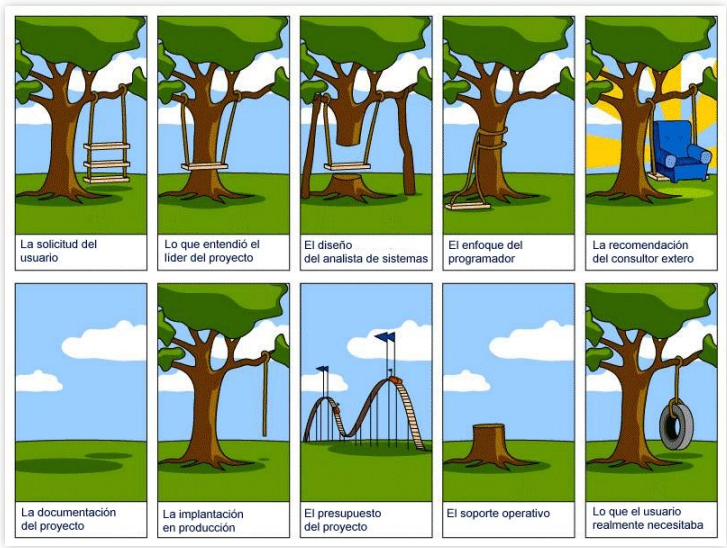

### “Deber ser” del Analista Funcional
      
    • Une el Negocio con IT.
    • Automatiza procesos.
    • Produce mejoras.
    • Incorpora Tecnología al Negocio.
    • Genera valor agregado.

### Habilidades del Analista Funcional

    • Mente analítica.
    • Rápido aprehender de los procesos del negocio.
    • Comunicador y negociador eficaz.
    • Tener sentido común y criterio.
    • Documentador pragmático.

### Conocimientos del Analista Funcional

    • Mercado: Conocer el marco empresarial.
    • Negocio: Conocer el ADN cultural.
    • Procesos: Conocer el qué y cómo
    • Tecnologías: Conocer de IT.
    • Funcional: Conocer técnicas de análisis.
    • Equipo e involucrados: Conocer a las personas.

### Gestión del Analista Funcional

    • Gestionar el alcance del proyecto (requerimientos).
    • Gestionar costos, tiempos y recursos (técnicos y humanos).
    • Gestionar calidad (QA/QC).
    • Gestionar clientes internos o externos y otras áreas.
    • Gestionar las comunicaciones (pedidos, informes, estadísticas).
    • Gestionar los riesgos.
    • Gestionar los proveedores.
    • Gestionar la integración.
    • Gestionar el control y seguimiento de todo.

## ¿Qué es una metodología?

Es un conjunto de métodos y técnicas que permiten el desarrollo de Software de una manera sistemática y con la mayor calidad posible.

### ¿Por qué / para qué usarla?

    • Mayor calidad y confiabilidad.
    • Menor re-trabajo.
    • Menor costo de corrección de errores.
    • Mayor eficiencia.
    • Menor riesgo potencial.
    • Mejor cumplimiento de plazos y estimaciones.

## Modelos

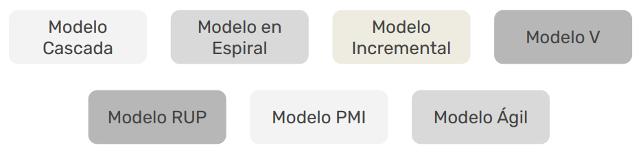

### Modelo Cascada o Tradicional

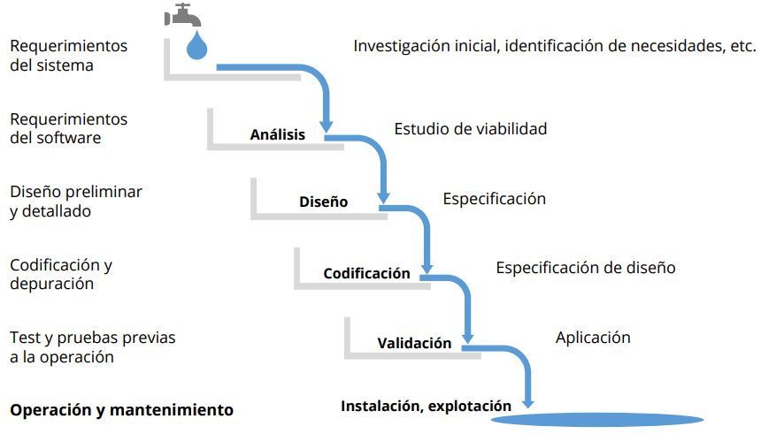

### Modelo Espiral

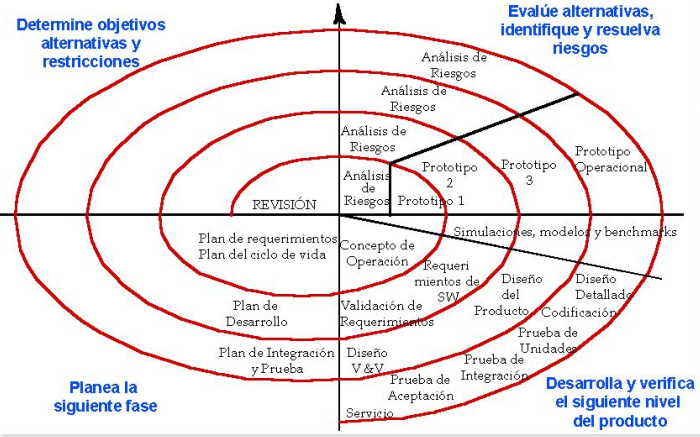

### Modelo Incremental

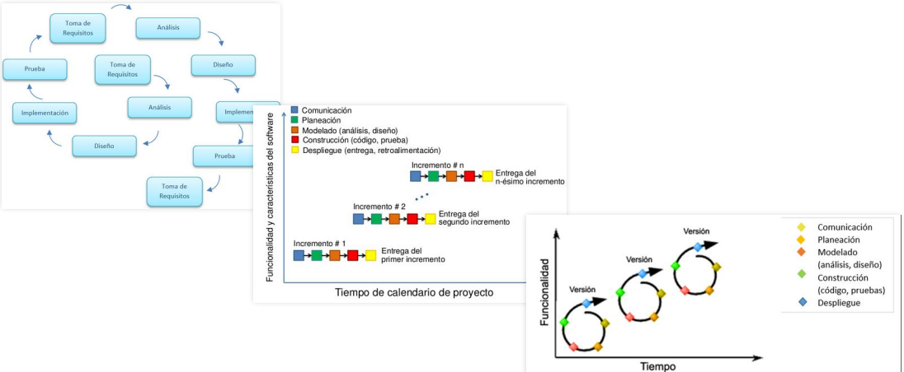

### Modelo PMI

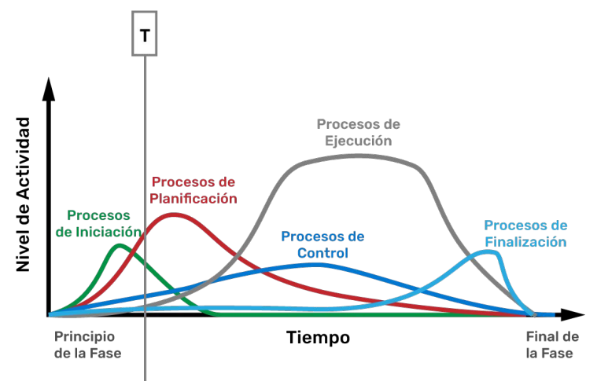

### Modelo Ágil

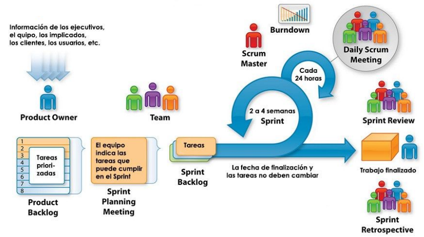

Visión del Team en un marco Ágil:

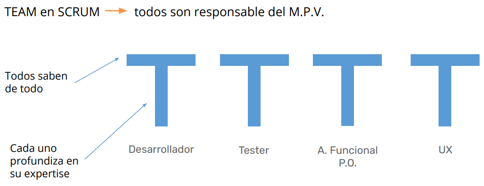

## Negociación – Criterios

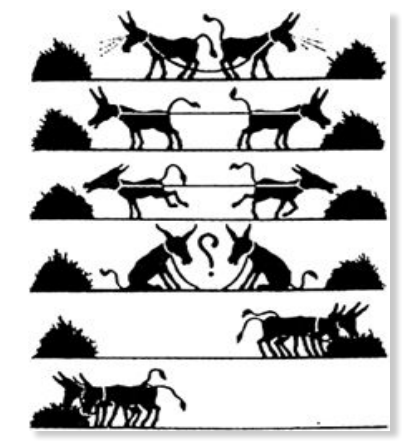

### Ganar-Ganar

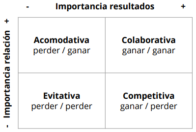

Perder – Perder: Ninguna de las partes logra su cometido
Ganar – Perder: Una de las partes queda satisfecha, la otra no
Ganar – Ganar: Ambas partes quedan satisfechas

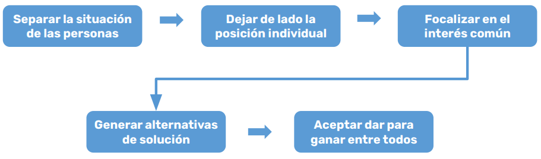

Enlaces sugeridos:
* Análisis de requerimientos: https://youtu.be/50aSAUFrALk
* Requerimientos Funcionales y No Funcionales: https://youtu.be/tF88eNhNSb4
* Scrum en 10 minutos: https://youtu.be/PlLHc60egiQ

## Éxito de un proyecto

### Causas de Fracaso

1. Falta de input de usuarios 12,8 %
2. Requerimientos y especificaciones incompletas 12,3 %
3. Cambios en requerimientos y especificaciones 11,8 %
4. Falta de respaldo ejecutivo 7,5 %
5. Incompetencia tecnológica 7,0 %
6. Falta de recursos 6,4 %
7. Falsas expectativas 5,9 %
8. Objetivos no claros 5,3 %
9. Tiempos no realistas 4,3 %
10. Nuevas tecnologías 3,7 %
11. Otros 23,0 %

### ¿Cómo planear?

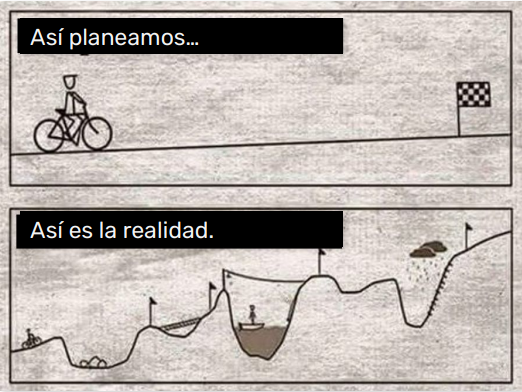

### Factores para lograr el éxito

1. Objetivos claramente definidos.
2. Gerente de Proyecto competente.
3. Apoyo a la Alta Dirección.
4. Miembros competentes en el equipo del proyecto.
5. Asignación de recursos suficientes.
6. Canales de comunicación adecuados.
7. Mecanismo de control.
8. Capacidades de retroalimentación.
9. Buena respuesta del cliente.

## Requerimientos

### Conceptos Generales

    • Es una descripción completa del comportamiento del sistema que se va a desarrollar.
    • Debe estar dirigida al producto del SW, no al proceso de producir el SW.
    • Describe las interacciones de los usuarios con el SW.
    • Contiene Requisitos Funcionales y Requisitos no Funcionales.
    • Está dirigida tanto al cliente como al equipo de desarrollo.
    • El lenguaje utilizado para su redacción debe ser informal, de forma que sea fácilmente comprensible para todos

Pueden incluirse requisitos, acordados entre el cliente y el proveedor:
    • Costos
    • Tiempos de entrega
    • Procedimientos para reportes
    • Métodos para el desarrollo de Software
    • Aseguramiento de Calidad
    • Criterios para validación y verificación
    • Procedimientos para aceptación

### Características

    • Completa.
    • Consistente.
    • Inequívoca.
    • Trazable.
    • Priorizable.
    • Modificable.
    • Verificable.

### Técnicas de análisis

1. Descomposición funcional: Consiste en dividir los requisitos en partes (analizarlos individualmente) hasta lograr que cada componente se pueda describir sin necesidad de referir a otro. De esta manera llegar a que cada parte del sistema tenga funciones independientes pudiendo reusarlos y/o reemplazarlos.
2. Especificación textual: Simplemente es la forma tradicional, consiste en desarrollar una narrativa más detallada en lenguaje natural.
3. Modelado del proceso: Es representar los requerimientos a través de flujogramas. Su naturaleza visual ayuda a la comprensión y comunicación. Cuando más complejos son los procesos, más deben desglosarse en subprocesos.
4. Modelado del dominio: Consiste en analizar los sistemas relacionados en un dominio, con la finalidad de mostrar un modelo de contexto del negocio. Se basa en diagramas conceptuales que incluyen comportamiento (del sistema) y sus datos. El análisis de dominio puede brindar modelos orientados a objetos o modelos relacionales de datos. Los cuales son usados por los desarrolladores como base de la arquitectura de software.
5. Casos de uso: Orientado a la funcionalidad. Sirven para especificar el comportamiento del sistema a través de las actividades del Usuario. Muestra una secuencia de interacciones entre un sistema y el usuario /entidad. También pueden usarse en el diseño del sistema y para definir casos de pruebas.
6. Checklists: Consiste en una serie de preguntas o revisiones sobre los requerimientos. Sirve de marco de trabajo y procedimental para revisar el requerimiento, facilitando su análisis de forma
estructurada.
7. Inspecciones: Revisión no destructiva de los requerimientos.
8. Prototipados: Consiste en elaborar representaciones visuales (UI) de los requerimientos. 
Es una herramienta muy útil para validar el diseño funcional con los usuarios, de manera temprana y determinar cuáles son indispensables y cuáles no.

## ¿Qué es IEEE – 830?

Es una guía para la redacción de los requerimientos de software.

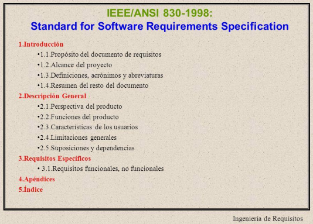

## Requisitos: Requerimiento específicos

    • Especificar los ‘requisitos específicos’ en conformidad con las características del usuario.
    • Deben tener referencias cruzadas a los documentos evidenciables.
    • Los requisitos deben tener ID único.
    • Deben estar organizados para su mayor entendimiento.

Enlaces sugeridos:
* Sistemas de calidad Norma ISO IEE830: https://youtu.be/KHKMMNO01jk
* Diagrama de Caso de Uso: https://youtu.be/EbLkWdh1Hpk
* Diagrama de Flujo: https://youtu.be/fDiLZct_b1U
* Diagrama de Secuencias: https://youtu.be/xiQfSFxuuBw
* Del caso de uso al diagrama de secuencia: https://youtu.be/7vsPNUnhzTA
* Relaciones de Caso de Uso: https://youtu.be/x4l1Sp03vQo

# Diseño

## Consideraciones:

* Amigabilidad: Poseer conceptos que sean familiares al usuario.
* Uniformidad: Mantener mismo formato, forma, concepto de teclas funcionales…
* Recuperabilidad: Poseer mecanismos de recuperación ante errores. Confirmación de acción destructiva; proporcionar recurso para deshacer; generar puntos de control.
* Asistencia al usuario: Ante errores o simplemente tener una guía de cómo interactúa el usuario, presentar la información.
* Diversidad: Características distintas ante tipos de usuarios diferentes.
* Legibilidad: Que sea simple de ver
* Navegabilidad: Que sea entendible
* Metáforas: Isotipos representativos de la realidad
* Centrado o focal: Que sea visible dónde se encuentra
* Coherencia: Todas las pantallas con las mismas reglas.

## Estimaciones

* Una estimación de software es una predicción de cuánto tiempo durará o costará su desarrollo y
mantenimiento. 
* Si se trata de una estimación de tiempo, el esfuerzo puede expresarse en horas-persona u otra unidad.
* Si se trata de estimación de costo, se puede expresar en la moneda de preferencia.

## Tipos de estimación

Clasificamos las técnicas de estimación en cuatro tipos:
1. Por juicio de expertos.
2. Por analogía (proyectos previos similares).
3. Por descomposición funcional.
4. Por medio de modelos de estimación (utilización de modelos paramétricos, procedimentales, algorítmicos, basados en fórmulas matemáticas y estadísticas).

Técnicas de estimación

1. Juicio Experto: de 3 puntos
    • Duración esperada = (Pesimista + (4 x Más probable) + Optimista) / 6
2. Juicio Experto: Wideband Delphi
    * El coordinador entrega el requerimiento a un grupo de expertos.
    * Se realiza un reunión de feedback entre ellos
    * Sin comunicación entre sí realiza individualmente la estimación
    * Luego, en forma anónima, se los entregan al coordinador quien prepara un resumen con el fin de reunirse para debatir sobre las variaciones y la estimación media.
    * Los expertos votan en forma anónima si están de acuerdo con la estimación media.
    * Si el voto es unánime se aprueba, sino se vuelve a estimar individualmente.
3. Por analogía
La organización debe contar con la información necesaria sobre las características, duración y costo real de proyectos previos para determinar si son comparables con el proyecto a estimar.
4. Descomposición: Top-Down
Mediante una estructura de desglose de trabajo (EDT) de alto nivel podemos hacer estimaciones de cada tarea para determinar esfuerzo y costo de forma general. Es usada habitualmente para evaluar la viabilidad de proyectos en fase de inicio.
5. Descomposición: Bottom-Up
Mediante una estructura de desglose de trabajo (EDT) detallada podemos hacer estimaciones más certeras (implica prácticamente realizar todo el análisis y diseño de la solución).
Es usada habitualmente para obtener mayor exactitud aunque conlleva mucho más tiempo.
6. Modelo: COCOMO II (Modelo constructivo de costos)
Aplica al realizar un cálculo matemático de la cantidad de líneas que se requieren en la solución o por cantidad de componentes, pantallas, tablas, y/o otros aspectos técnicos.
7. Modelo: Puntos de Función (IFPUG)
Realiza las valoraciones a partir de la funcionalidad del sistema.
8. Modelo: Poker Planning
Utilizada en proyectos ejecutados con metodologías ágiles, como Scrum. Basada, en parte, en la secuencia de números Fibonacci. La secuencia es: 1, 2, 3, 5, 8, 13, 20, 40 y 100.

## Puntos de Función

* Herramienta para realizar estimaciones de esfuerzo.
* Usa fórmulas matemáticas basadas en parámetros (tipo de componente, complejidad, factores del entorno, etc.).
* Sirve para "medir" el software a partir de requerimientos funcionalidades del usuario (no de especificaciones técnicas).
* Fue desarrollado por Allan Albrecht (IBM – 1979).

En términos generales, consiste en:
1. Clasificar los requisitos.
2. Asignar la complejidad.
3. Ponderar a cada uno según unas tablas predefinidas.
4. Determinar el valor de puntos de función.
5. Determinar valor total del requerimiento.
6. Aplicar factor de ajuste (desvío en más o menos).
7. Obtener horas hombres (vía factor de conversión).
8. Determinar el costo y presupuesto total.

Enlaces sugeridos:
* Análisis de puntos de función: https://youtu.be/BeP6dXdLLo8
* Descripción del método: https://youtu.be/mDkQgOaghLU

### Puntos de Función vs. Juicio Experto

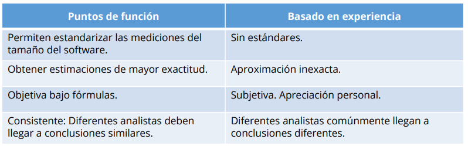